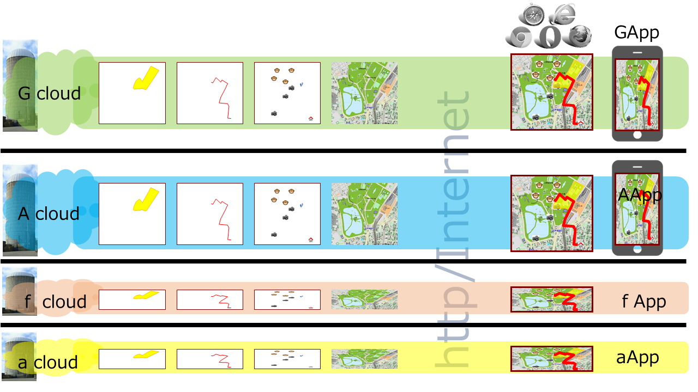
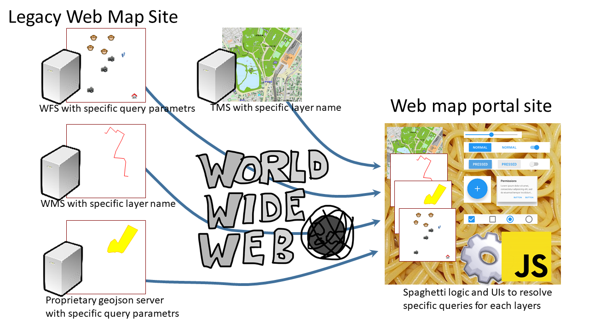
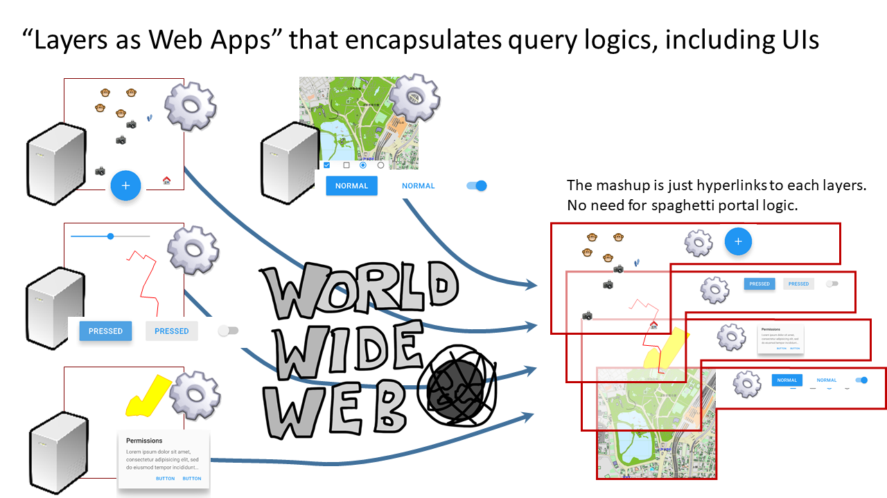

# Decentralized Web Mapping

Satoru Takagi ([satakagi](https://github.com/satakagi)), Sakiura Yu ([jakkyfc](https://github.com/jakkyfc))

The WWW and the Internet were designed to be decentralized in the first place. I'm not going to spend a lot of time here enumerating the features and benefits that de-centralization gives rise to. At least for those of us who are users of geographic information, rather than vendors of geographic information or systems, we see decentralized forms of geographic information distribution and use as much preferable to centralized ones.
This paper explores the centralized nature of current WebMap services, frameworks, and standards. We will then describe a methodology for transforming it into a de-centralized one. Finally, we will point out that that standardization should take place within the broader W3C, not within the geo industry.


## The Situation of Centralized WebMapping

Some of the OGC specifications have the word "Web" in them, such as [WMS](https://www.ogc.org/standards/wms) and [WFS](https://www.ogc.org/standards/wfs). Also, there are several specifications of tiled bit-image maps with the slang name of [WebMercator](https://en.wikipedia.org/wiki/Tiled_web_map), which are widely used. ([OpenStreetMap](https://wiki.openstreetmap.org/wiki/QuadTiles), [TMS](https://wiki.openstreetmap.org/wiki/TMS),[WMTS](https://www.ogc.org/standards/wmts),[bingMapTiles](https://docs.microsoft.com/en-us/bingmaps/articles/bing-maps-tile-system),googleMapTile : [osgeo tiling standards](https://wiki.osgeo.org/wiki/TilingStandard)) Are they decentralized in operation?

In general, a map site on the Web has a web page (home page) that serves as its own source of information for the people, and includes various geographical information (which is expressed as multiple layers of maps).

An open data minded site may publish technical information on a related page that allows each layer to be accessed via a standard Web API such as the one mentioned above. But this page is rarely utilized. Because one has to be a technical person to make use of it. After all, it can only be leveraged almost exclusively through the website prepared by the map site operator.

Also, some map sites that are not mindful of open data provide map content using standard Web APIs such as those mentioned above. Such sites have information available to the public, of course, but they nevertheless incorporate their own schemes and have built in access token issuing and authentication mechanisms to access geographic information. This is often seen in the information of government agencies as well.

In addition, map sites that aggregate not only their own map data but also data distributed by others, such as the open data mentioned above, are often found in sites called portals, aggregations, and mashups.

A common problem with all of these is the enclosure and siloing of the website portal. Existing standards for web mapping are largely powerless against this. In the first place, they have been standardized by vendors who aim to enclose themselves in these web portals.



## Technical Exploration of Centralization through Web Mapping Sites

It's clear from the discussion so far what the target of the mapping portal is centralizing. It's the layers. Let's try to decipher the technical reasons why web page portals can be enclosed by them.

The web pages of the web mapping site contain instructions and UI for proper use of each map layer. The mapping display conditions chosen by the user are communicated to the web service as necessary parameters behind the scenes to visualize the desired map.
Parameters such as display range, zoom level and coordinate system have a largely unified concept within the scope of Geo industry standards. On the other hand, what kind of data and layers you want to visualize and under what conditions is essential.
However, these are difficult to standardize as geographic information because of the diverse contexts in which the data is stored. These are what the Geo industry treats as optional arbitrary metadata or optional parameters. What these parameters are, and how and when they are set up to produce the output, are set up through the specific UI and js logic built into the homepage.　The same is true for access tokens, which are sent to the server as optional parameters for accessing geographic information through the token acquisition mechanism in the specific js logic built into the home page. The server uses the token as an authentication key to deliver the map data.

Schemes for setting these various parameters are outside the scope of what might be called a standard map API. Yes, these are issues that are beyond the scope of standardization in the context of geographic information. But this is just what makes Web Maps effectively impossible to interoperate with.
It is siloed by the proprietary parameter generation logic and UI for map content generation built into each web map site's own web app, and the situation is that it's a centralized operation by web pages, portals and aggregators.



### The problem of building in and spaghettiizing the website.

As far as author has analyzed, most websites have UI and js logic built into a single instance (that's the window instance of a web page/portal site) to set arbitrary parameters for each of these layers.
Despite the fact that map information has a strong connection to the traditional and logical encapsulation of layers, it is rarely used in site design. As a result, the site is spaghetti-like. This is not desirable from a technical point of view.

#### In the classic Semantic Web...
If the semantics/vocabulary of everything in the world beyond geographic information were standardized, the problem would go away because there would be no need for this inherent logic and UI. The stuck attempt to maintain it would be the classic semantic web, which is difficult to maintain.


On the other hand, in general web content rather than maps, for example, bit-images embedded therein can be easily deep-linked with a right click (unless you block them out), and this can be done on a social site or blog, for example. And this is routinely referenced on social networks and blogs, for example. But, maps can't do this for each layer either.


### Let's take a look at a real-life example.

For example, here's the URL to get the latest satellite images from [NOAA's now coast](https://nowcoast.noaa.gov/) site.
This site seems to support WMS.

```
https://nowcoast.noaa.gov/arcgis/services/nowcoast/sat_meteo_imagery_time/MapServer/WmsServer?
  SERVICE=WMS&
  REQUEST=GetMap&
  FORMAT=image/png&
  TRANSPARENT=TRUE&
  STYLES=&
  VERSION=1.3.0& LAYERS=9
  LAYERS=9&
  CRS=EPSG:3857&
 BBOX=13320199.166506998,2753408.109364978,16513424.366090318,5780349.220256351&
  WIDTH=1077&
  HEIGHT=826 
```

The arbitrary parameter that is particularly problematic here is the number `LAYERS=9`. You can't actually know what this layer number 9 is unless you check the NOAA website to see what the actual number 9 is.
It's true that WMS has a mechanism to get site metadata called [GetCapabilities](https://www.ogc.org/standards/wms/introduction#user-content-getcapabilities), but it doesn't operate well at all. Like the semantic web, there is no vocabulary for the arbitrary parameter part, so it's just a string of characters. Even the path section is a problem. This site eschews a lot of arbitrary parameters in the path section.


Let's look it up on [yr.no](https://yr.no/) as well. It looks like this, again, it's hard to know what the LAYERS string is.

```
https://public-wms.met.no/verportal/verportal.map?
  LAYERS=clouds_precipitation_regional&
  FORMAT=image/png&
  TIME=2020-08-25T03:00Z&
  EXCEPTIONS=application/vnd.ogc.se_xml&
  TRANSPARENT=TRUE&
  SERVICE=WMS&
  VERSION=1.1.1&
  REQUEST=GetMap&
  STYLES=&
  SRS=EPSG:3575&
  BBOX=-32000000,-3200000,640000,-2240000&
  WIDTH=384&
  HEIGHT=384
```

If you go to these sites and do a network monitor, you'll see that GetCapabilities is never issued from the portal WebApps. In short, they are not used.

But let's check it out.

**In NOAA nowcoast**

[`https://nowcoast.noaa.gov/arcgis/services/nowcoast/sat_meteo_imagery_time/MapServer/WmsServer?SERVICE=WMS&REQUEST=GetCapabilities`](https://nowcoast.noaa.gov/arcgis/services/nowcoast/sat_meteo_imagery_time/MapServer/WmsServer?SERVICE=WMS&REQUEST=GetCapabilities
)

```XML
<WMS_Capabilities ...>
  <Service>...</Service>
  <Capability>...
    <Layer>
      <Title><![CDATA[ NOAA NESDIS Geostationary Weather Satellite Imagery (Time Enabled) ]]></title>
      ...
      <Layer queryable="1">
        <Title><![CDATA[ Global Shortwave Infrared Mosaic ]]></Title>
        <Abstract><![CDATA[ ]]></Abstract>
        <CRS>CRS:84</CRS>
        ...
        <EX_GeographicBoundingBox>
          <westBoundLongitude>-179.906642</westBoundLongitude>
          <eastBoundLongitude>179.987720</eastBoundLongitude>
          <southBoundLatitude>-72.735739</southBoundLatitude>
          <northBoundLatitude>72.715408</northBoundLatitude>
        </EX_GeographicBoundingBox>
        ..
        <Dimension name="time" units="ISO8601" current="1">2020-09-14T18:00:00.000Z/2020-09-15T06:00:00.000Z/</Dimension>
        <Layer queryable="1">
          <Name>1</Name>
          <Title><![CDATA[ Image ]]></Title>
          <Abstract><![CDATA[ sat_gmgsi_sir ]]></Abstract>
        </Layer>
      </Layer>
    </Layer>
  </Capability>
</WMS_Capabilities>
```

Let's throw a What makes sense in the answer that comes back is the title attribute, which at best tells us what kind of title layer there is. The title is also extremely vague. It is difficult for the average user to get the information he or she wants. The now coast portal site has a much richer description of the site.

**Let's try the same thing on yr.no**

[https://public-wms.met.no/verportal/verportal.map?SERVICE=WMS&REQUEST=GetCapabilities](https://public-wms.met.no/verportal/verportal.map?SERVICE=WMS&REQUEST=GetCapabilities)

It's the same kind of thing. It might be better to see a little useful information in the layer's name attribute. (The noaa one was just numbered.)

**Next, let's look at a token example.**

Leaving aside the political issue of access tokens being used for public information in a government agency, we can obtain a map image with this request This access token is not made available to the public. The js logic in the portal site's `Window` instance is responsible for getting the token. Therefore, it is extremely difficult for the average person to cut out a layer of open data from this site and use it freely.

```
https://xx.xx.xx.xx/arcgis/rest/services/Msil/TopographyAndGeology/MapServer/export?
  token=[RandomString]&
  dpi=96&
  transparent=true&
  format=png8&
  layers=show:1&
  bbox=13320199.166506998,2833127.251485944,16513424.366090318,5676388.448152326&
  bboxSR=102100&
  imageSR=102100&
  size=872,777&
  f=image
```

From the above, we can see that metadata describing layers (that is, XML replies to GeoCapabilities, RDF statements, etc.) are not useful for decentralization of map layers.


## Propose an encapsulated web app that handles layers

The author has implemented the following scheme in [SVGMap.js](https://svgmap.org) in order to considerably improve the problems of this portal page. In this chapter, the author will explain the method and propose a new standardization for web maps and GIS.

First, back to what is actually being done on the Web Map site. We routinely set custom parameters for each layer by building WebApps that have their own logic and UI. The logic does not even use the metadata from GetCapabilities mentioned earlier.

So, the author came up with the following thoughts.

* The problem is that this proprietary logic is not on the layer side, but rather spaghettied into web pages, portals, and aggregators.
* If this logic was separated into layers and then moved to each layer, the layers could be cleanly encapsulated.
* As a result, the encapsulated layers could be decentralized.

This approach would not prevent practical site construction, as it would only break down the existing map portal WebApps into layers. Of course, the logic could remain hard-coded and proprietary, so there is no need to standardize the vocabulary of metadata.

To achieve this strategy, the author has devised a mechanism to handle the layers by defining individual logic separated by layers as small WebApps.



Here, such webApps are things that can be interpreted, executed, and displayed by common web browsers, and there is no need for the geo industry to standardize everything in detail.

The process, including the UI for setting arbitrary parameters needed to display each layer, is handled by webApps assigned to each layer, independent of the portal's Window object. to carry the container.

SVGMap describes the information as SVG-based content corresponding to the XML `<layer>` tag and its child elements returned by GetCapabilities of WMS. In other words, a layer is represented in the form of a single SVG file. Therefore, a layer is identified as the URL where the file is stored. Each layer is an identifier (URL) with no uncertain parameters. As a result, disclosing this URL to the user allows not the programmer but the average user to use the layer freely, independent of portal sites (just copy and paste the URL).


Unlike the `<list>` element in WMS, SVGMap allows this layer SVG file to have a link to HTML.(`data-controller` property in following example) This html is the WebApps that control the layer-specific parameters described above.

The referenced HTML, on the other hand, has some extended APIs that allow you to set the layer-specific parameters at your disposal. In the case of SVGMap, this is the API for accessing the DOM of a layered SVG document.

This simple mechanism is all it takes to create a framework that allows you to freely build a mechanism to generate arbitrary parameters to get each layer. Of course, since it's a `Window` object, you can freely create it via the UI, or you can build your own login logic to obtain an access token. On top of that, the logic is encapsulated in each layer, which prevents portals from becoming spaghetti-like. (Well, the spaghetti portals were a point of enclosure, too..)

However, this has its challenges. This is the issue of limiting the operation of web applications by cross-origin. Basically, the API cross-origin, which allows DOM access to the aforementioned layer SVGs, does not work. The author currently cancels this problem with proxy, which is not a preferred method. Cross-origin access between HTML documents has a mechanism to authorize it, such as CORS, and such a mechanism for SVGs would be an improvement.

`myLayer.svg`

```svg
<?xml version="1.0" encoding="UTF-8"? >
<svg data-controller="myLayerController.html" xmlns="http://www.w3.org/2000/svg" xmlns:xlink="http://www.w3.org/1999/xlink" viewBox="4062 406 625 774">
  <globalCoordinateSystem srsName="http://purl.org/crs/84" transform="matrix(13.88888888888888889,0.0,0.0,-13.888888888888889,2500.0,1181. 2656774973138)"/>
  
  <image xlink:href="sc1_0_0_l4_Gsi/gsi_l4_13_5.png" preserveAspectRatio="none" x="4062.5" y="406.591052" width="312.5" height="205.509374 "/>
  <image xlink:href="sc1_0_0_l4_Gsi/gsi_l4_13_6.png" preserveAspectRatio="none" x="4062.5" y="612.100427" width="312.5" height="264.40073 "/>
  <image xlink:href="sc1_0_0_l4_Gsi/gsi_l4_14_5.png" preserveAspectRatio="none" x="4375" y="406.591052" width="312.5" height="205.509374 "/>
  <image xlink:href="sc1_0_0_l4_Gsi/gsi_l4_14_6.png" preserveAspectRatio="none" x="4375" y="612.100427" width="312.5" height="264.40073"/>
</svg>
```

`myLayerController.html`

```html
<!doctype html>
<html>
<script>
function changeMap(mapNumber){
  imgs = svgImage.getElementsByTagName("image");
  ...
}
</script>
<body>.
 <input type="button" value="Change to Map1" onclick="changeMap(1)">
 <input type="button" value="Change to Map2" onclick="changeMap(2)">
</body>.
</html>
```


## Standardization on W3C

As mentioned above, these "arbitrary optional parameters" have been discarded as arbitrary because they are outside the scope of the Geo industry. However, it turns out that this has driven the centralization of WebMap. In addition, the author proposed a framework for setting arbitrary parameters by encapsulated WebApps without using semantics, which can be achieved by using HTML, CSS, and DOMAPI, which are web browser standards. In other words, the standard that is effective in "Siloing by arbitrary parameters" is not something that can be managed by the Geo industry alone. 

On the side, this method proposed by the author may not be the only solution to the problems of centralization. However, the author has confirmed from his practical experience that it is highly effective.

From the above, it is the author's opinion that it is appropriate for the W3C to work on the quest and standardization that promotes the decentralization of WebMapping.
