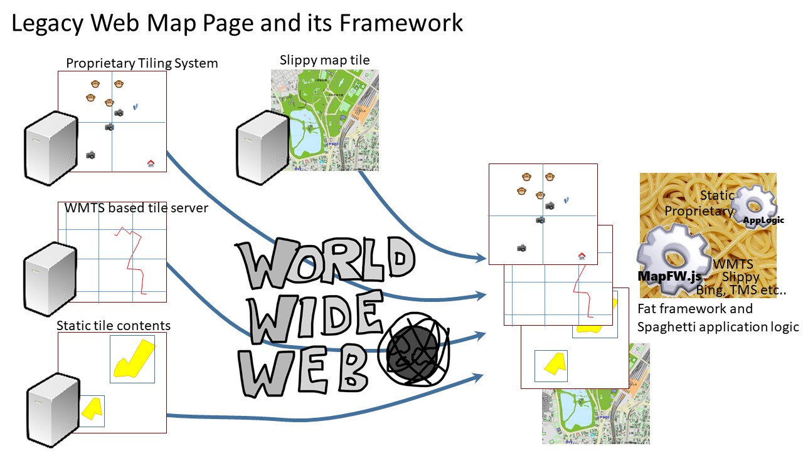

# Quad Tree Composite Tiling and the standardization of tiling

Satoru Takagi

## Introduction

The bit-image tile pyramid was made widely known by google Maps.

It has since been used as a de-facto standard tiling method by osm, bingMaps, and many other web maps.

wikipedia's [Tiled web map](https://en.wikipedia.org/wiki/Tiled_web_map) explains the situation relatively well.

In raster tiles, a relatively common tile scheme would be the following. From the author's implementation experience, OpenStreetMap Slippy map tilenames seems to be the most commonly used of these, but it is far from establishing a uniform tile scheme for URL representation.

* [OpenStreetMap Slippy map tilenames](https://wiki.openstreetmap.org/wiki/Slippy_map_tilenames)
* QuadTree encoding : [bingMapTile](https://docs.microsoft.com/en-us/bingmaps/articles/bing-maps-tile-system), [old google Maps](https://www.hydro-international.com/content/article/2d-3d-web-mapping)(This method uses a tile naming convention that encoded QuadTree with QRST strings)
* [TMS](https://wiki.openstreetmap.org/wiki/TMS)
* [WMTS](https://en.wikipedia.org/wiki/Web_Map_Tile_Service)


Vector tiles, on the other hand, are much more confusing and disparate from service to service and vendor to vendor.

In the meantime, author learned that the OGC has begun to look at standardizing it as a Vector Tiles Engineering Report and subsequent Vector Tiles Pilot ( though author is not a member of the OGC)

The OGC's consideration of tiling appears to have been based on the raster data tile service standard WMTS and the on-demand vector data service standard WFS.

Their first report is [here](http://docs.opengeospatial.org/per/17-041.html), where their basic policy for vector tiling standards seems to have been decided.
The author, on the other hand, has a very different view of this policy, based on his practical experience.

This paper points out the problems with the OGC's consideration of vector data tile standardization, and then presents a tiling method that we already have (for more than a decade) extensive operational experience with that can be eliminated.
Then, we introduce data description methods that are not only applicable to these methods, but also applicable to various tiling methods, including legacy methods such as those considered by the
It is also proposed as to how organizations should standardize tiling based on these methods.


## Issues of standardization policy (tiling architecture) in the Report
In OGC's [Chapter 6.4.3 of the Vector Tiles Engineering Report](http://docs.opengeospatial.org/per/17-041.html#_tiling_scheme_2), they provide a general tile for raster data They concluded that it is reasonable to apply essentially the same method to vectors as to pyramids, and their Vector Tiling standardization activities appear to be proceeding on this policy thereafter.
The author do not think this conclusion is valid. The reasons for this are given below.

The general tile pyramid for raster data here has the following tiling policies.
- Uniform tile division regardless of location
- Varying the number of tile divisions in proportion to the zoom level in a series of steps
We will call such a tile pyramid an "equally divided tile pyramid" in this paper.


Now, let's return to the basic argument.
The most important role of tiling is to provide a better map experience for the user by keeping the consumption of computing and network resources constant.

In this sense, the upper limit of data size of each vector tile should be constant regardless of zoom level and location.

In the case of raster data, the maximum data size of a tile is determined by the number of pixels in the bit image, no matter how many geographical objects are present. The amount of computer resources used is also roughly proportional to the number of raster data pixels. So an equally divided tile pyramid can guarantee that benefit.

Vectors, on the other hand, do not work that way. [Generalization](https://en.wikipedia.org/wiki/Cartographic_generalization) is essential for making tiles at the smaller scale level. However, it is a much more complex and uncertain process than raster data, requiring complex and advanced control over its logic in terms of individual data characteristics, visualization policies, and data size. [ESRI's guidebook may also be helpful](https://pro.arcgis.com/en/pro-app/help/mapping/map-authoring/author-a-map-for-vector-tile-creation.htm).
Further complicating this problem is the fact that most features are highly non-uniform in geospatial terms, for example, point information for cities on Earth (which is almost non-existent at sea or in the nooks and crannies). For such data, the effectiveness of an equally divided tile pyramid is much more uncertain than for raster data. Anyone who has worked with real data should be able to understand this. At worst, if the generalizations fail at all, the equally divided tile pyramid is no longer effective at all.　Their report virtually ignores this problem.


This problem seems to be exposed in subsequent reports as well, as shown below.
Bit-image data is delivered as binary data with high data storage efficiency, in some cases irreversibly compressed.
On the other hand, the author is experienced that the dominant format of vector data delivered by WFS, for example, is highly human readable, such as XML and JSON. The efficiency of storing these data is not so much, though there are some variations. They implicitly suggest that the further validation of delivering such inefficient data using an even less effective equally-divided tile pyramid has made it less practical.
Specifically, they were constrained to [mention the use of a combination of non-standard serialization methods](https://docs.ogc.org/per/18-086r1.html#_pilot_overview), such as google protocol buffers, which are far from standard, with higher transmission efficiency.  If tiling was highly effective enough, they wouldn't dare mention that stuff. (If they want to do it non-standard, they can do it on their own.)

## Quad Tree Tiling

In order to keep the size of geospatially non-uniform vector tile data as constant as possible, which cannot be reduced even by generalization, some attempts have been made to introduce Quad Tree.


For example, 
* [ESRI's guidebook and](https://desktop.arcgis.com/en/arcmap/10.3/tools/cartography-toolbox/create-cartographic-partitions.htm)
* and the following articles It is featured in the stand.
  * https://pro.arcgis.com/en/pro-app/tool-reference/data-management/create-vector-tile-index.htm
  * https://engblog.yext.com/post/geolocation-caching
  * https://thoughtbot.com/blog/how-to-handle-large-amounts-of-data-on-maps ...

However, this is not the enough to make appropriate data according to the display scale. The reason is that the tile pyramid is not yet constructed.

## Quad Tree Copposite Tiling

The author has developed a method called Quad Tree Copposite Tiling that solves the problem in the previous section, and has accumulated a number of practical applications using this method.
The method is described in the figure below, where the depth of the Quad Tree is assigned to the hierarchy of the pyramid. 


Once a full-resolution tile is generated, we do not generate a deeper tile, but use a shallower depth of the generated tile. Shallow depths (smaller scales), which are not capable of producing full-resolution tiles, should be constructed using some generalization method. An extreme but extremely hard-to-fail alternative to that method is to choose bit-images.
 (The author's open source implementation uses bit-images for small-scale tiles.) 

The author has proven in a decade of practical use in the enterprise that mixed vector and raster tiles constructed in this way have a high degree of utility.

In particular, the use of rasters as small-scale tiles may lead to a loss of feature semantics compared to vector tiles in generalization. In terms of the interface, rasterization is also effective in avoiding the complex problem of generalization because it is almost useless for users to recognize dense features.
However, in terms of the more complex concept of features, raster data can be interpreted as a feature called "coverage" in the form of a grid, which is a simple and unbreakable type of generalization.
In addition, this method has the advantage that the total number of tiles can be reduced considerably compared to raster tile pyramids.


## The Importance of Diverse Tiling

Now, it is important to note that equally-divided tile pyramids are not very effective, especially for vector tiles, and in some cases, there are many much better methods, such as Quad Tree Composite Tiling as implemented by the author, that are possible. In addition, there are cases where it is not possible to build a single data set as an equally divided tile pyramid for other reasons than performance and efficiency. Often, even though the local governments not only manage the data for the area, but also are responsible for data distribution, they are often provided with data that are considered to be part of a national dataset, and the tiles are no longer a jigsaw puzzle of random shapes. to be.

From the above, it is not very appropriate for the vector tiling standard to make equally divided tiling the only option that the OGC is now considering, and
The Author considers that it needs to be flexible enough to allow more freedom in tiling compared to raster.

## Tiling Framework as WebApps

The authors have implemented a framework in [SVGMap.js](http://svgmap.org/) that satisfies this requirement of allowing a variety of tiling schemes.
The architecture of this framework is also common to the architecture for facilitating decentralization described in [another paper](de-centralized%20web%20mapping.md).
As it is described in the chapter title, it is a mechanism that allows for the inclusion of javascript logic in map data and content.

Traditionally, it seems to have been believed that any one of the several tiling algorithms mentioned so far would have to be determined and implemented through standardization. But in reality, there is a diversity of them, and this is what the existing framework looks like.



The concept of this framework, on the other hand, does not have the tiling algorithm itself in the framework, as mentioned earlier. Instead, the map data content is allowed to have javascript logic. You can then use it to add arbitrary tiling logic to your layers.


Here, the essential functional elements for building tiling logic are the ability to refer to other graphics (it can be SVG or bit image), which are standardized in SVG, and to paste them to a specified coordinate area, its description format (`image` element and `animation` element), the and DOM API to control it with javascript. However, most of them have already been standardized at the W3C.
The major difference between the concept of previous Geo industry standards is the concept of including javascript logic as geospatial data and content.

According to this approach, the petty but obviously specifically different WMTS, TMS, OpenStreetMapTile, and BingMapTile would only need to have their tile URL generation logic written with javascript. These logics are usually only a few dozen lines long and can be written in a few dozen lines.

In fact, the enterprise WebGIS that the author is operating with SVGMap has all of this multispecies sometimes proprietary tiling logic running together. The number of layers is over 700.


### Examples of concrete data are shown below.

Example 1: There are two ways to handle equally-divided tile pyramid data, such as WMTS, TMS, OpenStreetMapTile, and BingMapTile, in SVGMap. One is to statically expand them inline.
```
TBD
```

Example 2: The other is to include logic in the layer with javascript defining the structure of the tile pyramid (it's a simple sequence-like function, so it can be written in a few dozen lines of short logic)
```
TBD
```

Example 3: Quad Tree Composite Tiling data is easy to use for static inline expansion because it is a random tile split based on location. Since the number of tiles can often be significantly reduced to start with, the increase in hyperlinks due to inline expansion is not a serious concern.
```
TBD
```


## Discussion on standardization

The author has shown in the previous chapter that equally divided tile pyramids such as raster tiles are not very effective in vector tiling, and also showed that better methods exist.
In addition, a flexible framework architecture is presented that can accept these and various other tiling methods.
However, the architecture is based on a more generic, but very complex standard for web browsers and is no longer likely to be in the hands of the Geo industry's standards organization alone.

The author has been holding this view of WebMapping since the early 2000's and has been keeping his activities away from the Geo industry for that reason. The fact that the W3C and the OGC will be holding the first joint workshop on WebMapping shows that the stakeholders are finally coming together on these issues.

From the above, the author suggest that there needs to be a broader discussion that includes not only vector tiling but also the importance of decentralized web mapping, as suggested by the author in another paper.
The author also suggests that the Geo industry should participate in the W3C in order to make the various discussions on the standardization process more industry-neutral and more open-ended.
